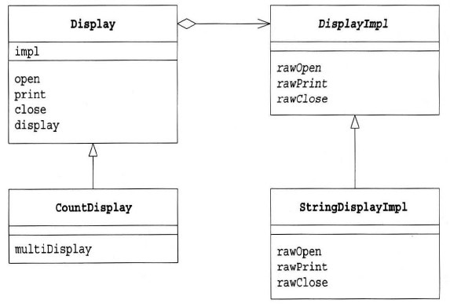
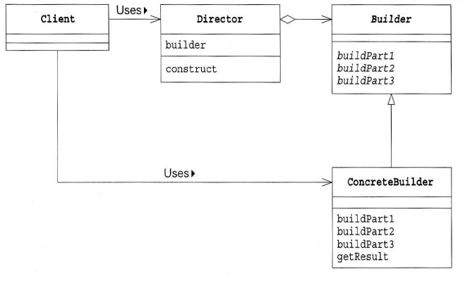

## Chapter 14

### 브리지 패턴
다리의 역할은 서로 떨어져 있는 두장소를 이어주는 것이다.

다리가 강 양쪽의 장소를 연결하는 역할을 하듯이 Bridge 패턴도 두장소를 연결하는 역할을 한다.

Bridge 패턴이 다리 역할을 하고 있는 두 곳은 다음과 같다.
```
​기능 클래스 계층(추상 클래스 계층)     ||=========||    구현클래스 계층
```

기능 클래스 계층 : 기능을 추가하는 클래스가 있음.(상속)

구현 클래스 계층 : 인터페이스를 구현하는 클래스가 있음.​

has-a 관계로 기능 클래스 계층과 구현 클래스 계층을 잇는다.



```java
// 기능 클래스 계층
public class Display {
	// impl 필드는 Display 구현을 나타내는 인스턴스 입니다. 
	// 이 필드가 두 클래스 계층의 '다리'가 됩니다.
	private DisplayImpl impl; 
	public Display(DisplayImpl impl) {
		this.impl = impl;
	}
	public void open(){
		impl.rawOpen();
	}
	public void print(){
		impl.rawPrint();
	}
	public void close(){
		impl.rawClose();
	}
	public final void display(){
		open();
		print();
		close();
	}
}

// 기능 클래스 계층
public class CountDisplay extends Display {
	public CountDisplay(DisplayImpl impl) {
		super(impl);
	}
	public void multiDisplay(int times){
		open();
		for(int i = 0; i< times; i++){   	// times회 반복해서 표시한다
			print();
		}
		close();
	}
}

// 구현 클래스 계층
public abstract class DisplayImpl {
	public abstract void rawOpen();
	public abstract void rawPrint();
	public abstract void rawClose();
}

// 구현 클래스 계층
public class StringDisplayImpl extends DisplayImpl {	
	private String string;			   // 표시해야 할 문자열
	private int width;				   // 바이트 단위로 계산할 문자열의 '길이'
	public StringDisplayImpl(String string) {		// 생성자에서 전달된 문자열 string을
		this.string = string;						// 필드에 기억해둔다.
		this.width = string.getBytes().length; 	    // 그리고 바이트 단위의 길이도 필드에 기억해두고 나중에 사용한다.
	}
	@Override
	public void rawOpen() {
		printLine();
	}
	@Override
	public void rawPrint() {
		System.out.println("|" + string + "|");    // 앞뒤에 "|" 를 붙여서 표시한다.
	}
	@Override
	public void rawClose() {
		printLine();
	}
	private void printLine() {
		System.out.print("+");		           // 테두리의 모서리를 표현하는 "+" 마크를 표시한다.
		for (int i = 0; i < width; i++) {	   // width개의 "-"를 표시해서
			System.out.print("-");			   // 테두리 선으로 이용한다.
		}
		System.out.println("+");	           // 테두리 모서리를 표시하는 "+" 마크를 표시한다.
	}
}

//main
public class Main {
	public static void main(String[] args) {	
		Display d1 = new Display(new StringDisplayImpl("Hello, Korea!"));
		Display d2 = new CountDisplay(new StringDisplayImpl("Hello, World!"));
		CountDisplay d3 = new CountDisplay(new StringDisplayImpl("Hello, Universe!"));
		
		d1.display();
		d2.display();
		d3.display();
		
		d3.multiDisplay(5);
	}
}
```

### 빌더 패턴
Builder 패턴이란 작은 구조를 가진 인스턴스를 쌓아 올려서 큰 구조를 만드는 패턴을 말한다.

제품을 여러 단계로 나눠서 만들도록 제품 생산 단계를 캡슐화한다.

빌더 패턴의 좋은 예시가 있어서 갖고 왔다.

https://m.blog.naver.com/tradlinx0522/220925078842?recommendTrackingCode=2



```java
//main
public class Main {
	public static void main(String[] args) {
		if(args.length != 1){
			usage();
			System.exit(0);
		}

		if(args[0].equals("plain")) {
			
			TextBuilder textbuilder = new TextBuilder();
			Director director = new Director(textbuilder);
			director.construct();
			String result = textbuilder.getResult();
			System.out.println(result);
		
		}else if(args[0].equals("html")) {
		
			HTMLBuilder htmlbuilder = new HTMLBuilder();
			Director director = new Director(htmlbuilder);
			director.construct();
			String filename = htmlbuilder.getResult();
			System.out.println(filename + "가 작성되었습니다.");
		
		}else {
			usage();
			System.exit(0);
		}
	}

	private static void usage() {
		// TODO Auto-generated method stub
		System.out.println("Usage: java Main plain 일반 텍스트로 문서작성");
		System.out.println("Usage: java Main plain HTML 파일로 문서작성");
	}

}
​
Main 클래스는 Builder 클래스의 메소드를 모른다. Main 클래스는 Director 클래스의 Construct 메소드만을 호출 한다. 그러면 Director 클래스 안에서 조용히 일이 진행되고 Main은 모르게 문서가 완성된다.

Director 클래스가 알고 있는 것은 Builder 클래스이다. Director 클래스는 Builder 클래스의 메소드를 사용해서 문서를 만든다. 그러나 Director 클래스는 자신이 실제로 이용하는 클래스 사실 무엇인지 모른다. TextBuilder인지, HtmlBuilder 인지 또는 Builder 의 다른 하위 클래스인지 모른다.

public class Director {
	
	private Builder builder;

	public Director(Builder builder) { 		// Builder의 하위 클래스의 인스턴스가 주어지므로
		this.builder = builder;			// Builder 필드에 저장해 둔다.
	}
	
	public void construct(){			// 문서구축
		
		builder.makeTitle("Greeting");		// 타이틀
		builder.makeString("아침과 낮에"); 	// 문자열
		builder.makeItems(new String[] {
				"좋은 아침입니다.",
				"안녕하세요",
		});
		
		builder.makeString("밤에"); 			// 별도의 문자열
		builder.makeItems(new String[] {
				"안녕하세요.",
				"안녕히 주무세요.",
				"안녕히 계세요.",
		});
		
		builder.close(); 				// 문서를 완성시킨다.
	}
}
​

public abstract class Builder {
	
	public abstract void makeTitle(String title);
	public abstract void makeString(String str);
	public abstract void makeItems(String[] items);
	public abstract void close();
	
}
위에서 보다시피 Director 클래스는 Builder 클래스의 메소드만을 사용하고 있고 Builder 클래스의 하위 클래스는 그 메소드를 구현한다. Director 클래스가 자신이 이용하는 Builder 클래스의 하위 클래스를 모른다.

왜냐하면, 모르기 때문에 교체가 가능하기 때문이다. TextBuilder 인스턴스로 만들지, HtmlBuilder 인스턴스로 만들지 아니면 다른 하위 클래스로 만들지 Director 클래스가 Builder의 구체적인 하위 클래스를 모르기 때문에 교환이 가능하다.

public class TextBuilder extends Builder {

	private StringBuffer buffer = new StringBuffer(); 						// 필드의 문서를 구축한다.
	
	// 일반 텍스트의 제목
	@Override
	public void makeTitle(String title) {
		// TODO Auto-generated method stub
		buffer.append("===========================================\n");		// 장식선
		buffer.append("『" + title + "』\n");									
		buffer.append("\n");												// 빈 행
		
	}

	// 일반 텍스트에서의 문자열
	@Override
	public void makeString(String str) {			// 일반 텍스트에서의 문자열
		// TODO Auto-generated method stub
		buffer.append("■" + str + "\n");		// ■ 글머리 기호 붙은 문자열 
		buffer.append("\n");				// 빈 행
	}

	// 일반 텍스트에서의 개별항목
	@Override
	public void makeItems(String[] items) {
		// TODO Auto-generated method stub
		for(int i=0; i<items.length; i++){
			buffer.append(" ·" + items[i] + "\n");	// · 글머리 기호 붙은 항목
		}
		buffer.append("\n");
	}

	// 문성의 완성
	@Override
	public void close() {
		// TODO Auto-generated method stub
		buffer.append("===========================================\n"); // 장식선
	}
	
	public String getResult(){
		return buffer.toString();
	}

}
```