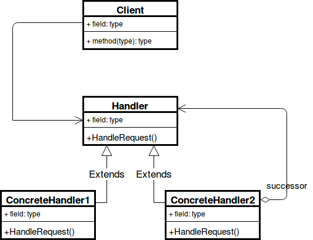
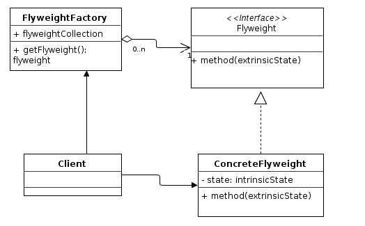
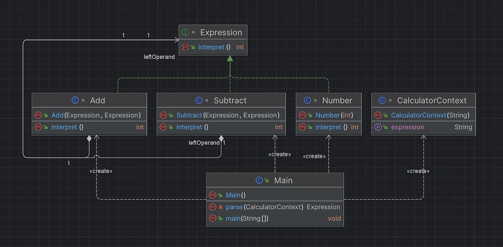
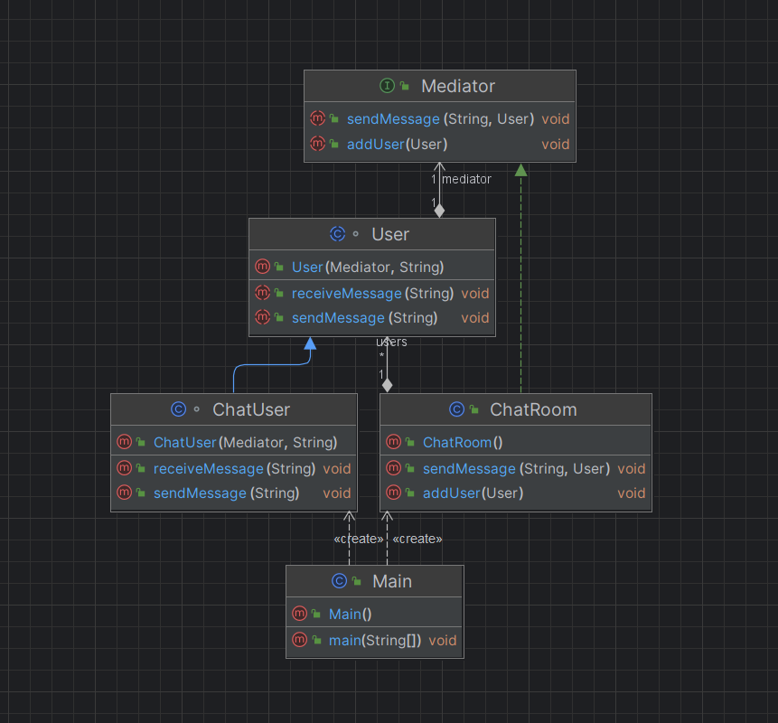
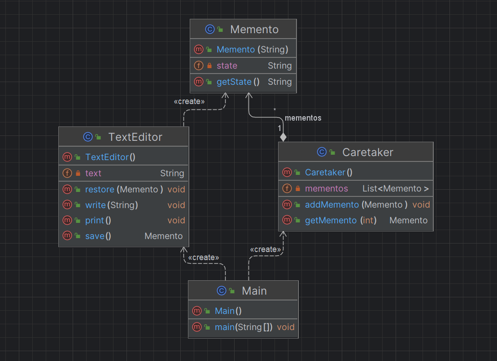
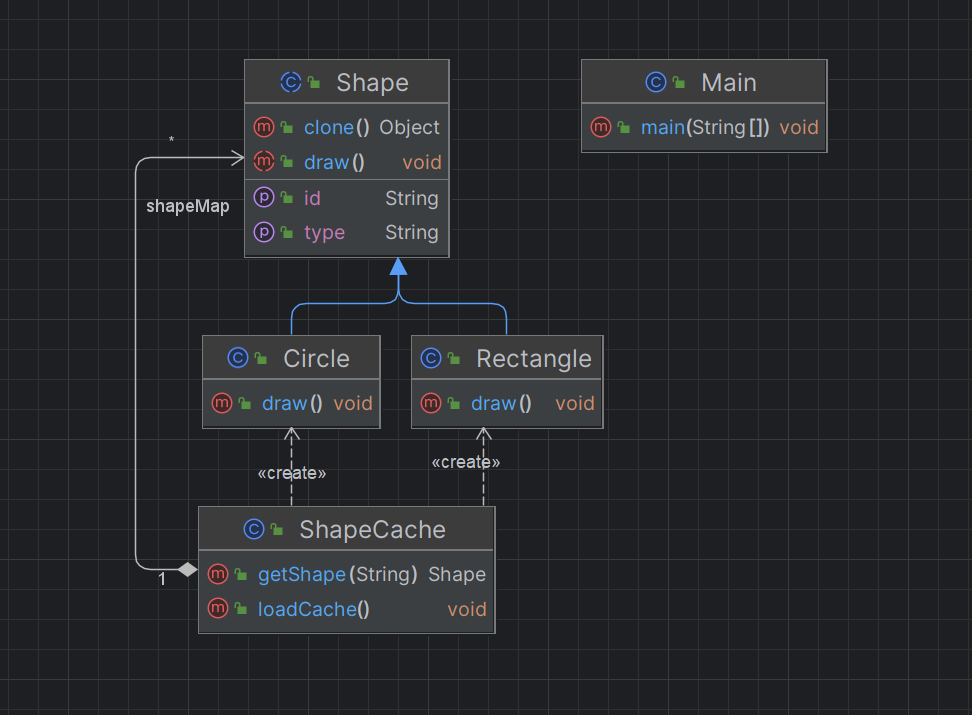
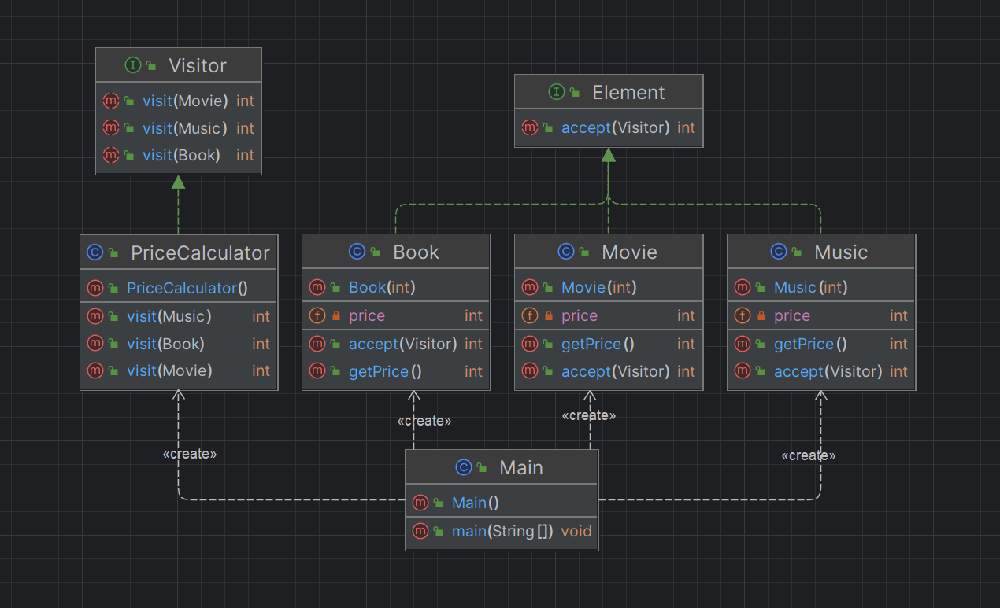

## Chapter 14

https://shan0325.tistory.com/category/JAVA/%EB%94%94%EC%9E%90%EC%9D%B8%20%ED%8C%A8%ED%84%B4

이 분의 블로그 글이 공부하는데 도움이 많이 되었다.

### 브리지 패턴
다리의 역할은 서로 떨어져 있는 두장소를 이어주는 것이다.

다리가 강 양쪽의 장소를 연결하는 역할을 하듯이 Bridge 패턴도 두장소를 연결하는 역할을 한다.

Bridge 패턴이 다리 역할을 하고 있는 두 곳은 다음과 같다.
```
​기능 클래스 계층(추상 클래스 계층)     ||=========||    구현클래스 계층
```

기능 클래스 계층 : 기능을 추가하는 클래스가 있음.(상속)

구현 클래스 계층 : 인터페이스를 구현하는 클래스가 있음.​

has-a 관계로 기능 클래스 계층과 구현 클래스 계층을 잇는다.


```java
// 기능 클래스 계층
public class Display {
	// impl 필드는 Display 구현을 나타내는 인스턴스 입니다. 
	// 이 필드가 두 클래스 계층의 '다리'가 됩니다.
	private DisplayImpl impl; 
	public Display(DisplayImpl impl) {
		this.impl = impl;
	}
	public void open(){
		impl.rawOpen();
	}
	public void print(){
		impl.rawPrint();
	}
	public void close(){
		impl.rawClose();
	}
	public final void display(){
		open();
		print();
		close();
	}
}

// 기능 클래스 계층
public class CountDisplay extends Display {
	public CountDisplay(DisplayImpl impl) {
		super(impl);
	}
	public void multiDisplay(int times){
		open();
		for(int i = 0; i< times; i++){   	// times회 반복해서 표시한다
			print();
		}
		close();
	}
}

// 구현 클래스 계층
public abstract class DisplayImpl {
	public abstract void rawOpen();
	public abstract void rawPrint();
	public abstract void rawClose();
}

// 구현 클래스 계층
public class StringDisplayImpl extends DisplayImpl {	
	private String string;			   // 표시해야 할 문자열
	private int width;				   // 바이트 단위로 계산할 문자열의 '길이'
	public StringDisplayImpl(String string) {		// 생성자에서 전달된 문자열 string을
		this.string = string;						// 필드에 기억해둔다.
		this.width = string.getBytes().length; 	    // 그리고 바이트 단위의 길이도 필드에 기억해두고 나중에 사용한다.
	}
	@Override
	public void rawOpen() {
		printLine();
	}
	@Override
	public void rawPrint() {
		System.out.println("|" + string + "|");    // 앞뒤에 "|" 를 붙여서 표시한다.
	}
	@Override
	public void rawClose() {
		printLine();
	}
	private void printLine() {
		System.out.print("+");		           // 테두리의 모서리를 표현하는 "+" 마크를 표시한다.
		for (int i = 0; i < width; i++) {	   // width개의 "-"를 표시해서
			System.out.print("-");			   // 테두리 선으로 이용한다.
		}
		System.out.println("+");	           // 테두리 모서리를 표시하는 "+" 마크를 표시한다.
	}
}

//main
public class Main {
	public static void main(String[] args) {	
		Display d1 = new Display(new StringDisplayImpl("Hello, Korea!"));
		Display d2 = new CountDisplay(new StringDisplayImpl("Hello, World!"));
		CountDisplay d3 = new CountDisplay(new StringDisplayImpl("Hello, Universe!"));
		
		d1.display();
		d2.display();
		d3.display();
		
		d3.multiDisplay(5);
	}
}
```

### 빌더 패턴
Builder 패턴이란 작은 구조를 가진 인스턴스를 쌓아 올려서 큰 구조를 만드는 패턴을 말한다.

제품을 여러 단계로 나눠서 만들도록 제품 생산 단계를 캡슐화한다.

빌더 패턴의 좋은 예시가 있어서 갖고 왔다.

https://m.blog.naver.com/tradlinx0522/220925078842?recommendTrackingCode=2


```java
//main
public class Main {
	public static void main(String[] args) {
		if(args.length != 1){
			usage();
			System.exit(0);
		}

		if(args[0].equals("plain")) {
			
			TextBuilder textbuilder = new TextBuilder();
			Director director = new Director(textbuilder);
			director.construct();
			String result = textbuilder.getResult();
			System.out.println(result);
		
		}else if(args[0].equals("html")) {
		
			HTMLBuilder htmlbuilder = new HTMLBuilder();
			Director director = new Director(htmlbuilder);
			director.construct();
			String filename = htmlbuilder.getResult();
			System.out.println(filename + "가 작성되었습니다.");
		
		}else {
			usage();
			System.exit(0);
		}
	}

	private static void usage() {
		// TODO Auto-generated method stub
		System.out.println("Usage: java Main plain 일반 텍스트로 문서작성");
		System.out.println("Usage: java Main plain HTML 파일로 문서작성");
	}

}
​
Main 클래스는 Builder 클래스의 메소드를 모른다. Main 클래스는 Director 클래스의 Construct 메소드만을 호출 한다. 그러면 Director 클래스 안에서 조용히 일이 진행되고 Main은 모르게 문서가 완성된다.

Director 클래스가 알고 있는 것은 Builder 클래스이다. Director 클래스는 Builder 클래스의 메소드를 사용해서 문서를 만든다. 그러나 Director 클래스는 자신이 실제로 이용하는 클래스 사실 무엇인지 모른다. TextBuilder인지, HtmlBuilder 인지 또는 Builder 의 다른 하위 클래스인지 모른다.

public class Director {
	
	private Builder builder;

	public Director(Builder builder) { 		// Builder의 하위 클래스의 인스턴스가 주어지므로
		this.builder = builder;			// Builder 필드에 저장해 둔다.
	}
	
	public void construct(){			// 문서구축
		
		builder.makeTitle("Greeting");		// 타이틀
		builder.makeString("아침과 낮에"); 	// 문자열
		builder.makeItems(new String[] {
				"좋은 아침입니다.",
				"안녕하세요",
		});
		
		builder.makeString("밤에"); 			// 별도의 문자열
		builder.makeItems(new String[] {
				"안녕하세요.",
				"안녕히 주무세요.",
				"안녕히 계세요.",
		});
		
		builder.close(); 				// 문서를 완성시킨다.
	}
}
​

public abstract class Builder {
	
	public abstract void makeTitle(String title);
	public abstract void makeString(String str);
	public abstract void makeItems(String[] items);
	public abstract void close();
	
}
위에서 보다시피 Director 클래스는 Builder 클래스의 메소드만을 사용하고 있고 Builder 클래스의 하위 클래스는 그 메소드를 구현한다. Director 클래스가 자신이 이용하는 Builder 클래스의 하위 클래스를 모른다.

왜냐하면, 모르기 때문에 교체가 가능하기 때문이다. TextBuilder 인스턴스로 만들지, HtmlBuilder 인스턴스로 만들지 아니면 다른 하위 클래스로 만들지 Director 클래스가 Builder의 구체적인 하위 클래스를 모르기 때문에 교환이 가능하다.

public class TextBuilder extends Builder {

	private StringBuffer buffer = new StringBuffer(); 						// 필드의 문서를 구축한다.
	
	// 일반 텍스트의 제목
	@Override
	public void makeTitle(String title) {
		// TODO Auto-generated method stub
		buffer.append("===========================================\n");		// 장식선
		buffer.append("『" + title + "』\n");									
		buffer.append("\n");												// 빈 행
		
	}

	// 일반 텍스트에서의 문자열
	@Override
	public void makeString(String str) {			// 일반 텍스트에서의 문자열
		// TODO Auto-generated method stub
		buffer.append("■" + str + "\n");		// ■ 글머리 기호 붙은 문자열 
		buffer.append("\n");				// 빈 행
	}

	// 일반 텍스트에서의 개별항목
	@Override
	public void makeItems(String[] items) {
		// TODO Auto-generated method stub
		for(int i=0; i<items.length; i++){
			buffer.append(" ·" + items[i] + "\n");	// · 글머리 기호 붙은 항목
		}
		buffer.append("\n");
	}

	// 문성의 완성
	@Override
	public void close() {
		// TODO Auto-generated method stub
		buffer.append("===========================================\n"); // 장식선
	}
	
	public String getResult(){
		return buffer.toString();
	}

}
```

### 책임 연쇄 패턴
1개의 요청을 2개 이상의 객체에서 처리해야할 때 책임 연쇄 패턴을 사용한다.

사슬에 속해 있는 각 객체는 자기가 받은 요청을 검사해서 직접 처리하거나 사슬에 들어있는 다른 객체에게 넘긴다.



```java
public interface Chain {
    public abstract void setNext(Chain nextInChain);
    public abstract void process(Number request);
}

public class Number {
    private int number;
    
    public Number(int number) {
        this.number = number;
    }
    public int getNumber() {
        return number;
    }
    
}

public class NegativeProcessor implements Chain{
    private Chain nextInChain;
    
    @Override
    public void setNext(Chain nextInChain) {
        this.nextInChain = nextInChain;
    }
 
    @Override
    public void process(Number request) {
        if(request.getNumber() < 0) {
            System.out.println("NegativeProcessor : " + request.getNumber());
        } else {
            nextInChain.process(request);
        }
    }
}

public class ZeroProcessor implements Chain{
    private Chain nextInChain;
    
    @Override
    public void setNext(Chain nextInChain) {
        this.nextInChain = nextInChain;
    }
 
    @Override
    public void process(Number request) {
        if(request.getNumber() == 0) {
            System.out.println("ZeroProcessor : " + request.getNumber());
        } else {
            nextInChain.process(request);
        }
    }
}

public class PositiveProcessor implements Chain{
    private Chain nextInChain;
    
    @Override
    public void setNext(Chain nextInChain) {
        this.nextInChain = nextInChain;
    }
 
    @Override
    public void process(Number request) {
        if(request.getNumber() > 0) {
            System.out.println("PositiveProcessor : " + request.getNumber());
        } else {
            nextInChain.process(request);
        }
    }
}

public class Main {
    public static void main(String[] args) {
        Chain c1 = new NegativeProcessor();
        Chain c2 = new ZeroProcessor();
        Chain c3 = new PositiveProcessor();
        
        c1.setNext(c2);
        c2.setNext(c3);
        
        c1.process(new Number(90));
        c1.process(new Number(-50)); 
        c1.process(new Number(0)); 
        c1.process(new Number(91)); 
    }
}

```
위의 예시를 보다시피 c1 체인에 c2,c3을 걸고 새 숫자가 들어올 때마다 음수,0,양수일 때 다 잘 처리하고 있다.

### 플라이웨이트 패턴
어떤 클래스의 인스턴스 한 개로 여러 개의 **가상 인스턴스**를 제공하고 싶을 때 사용하는 패턴이다.

즉 인스턴스를 가능한 대로 공유시켜 쓸데없이 new연산자를 통한 메모리 낭비를 줄이는 방식이다.



```java
//Shape
public interface Shape {
    public void draw();
}

//Circle
public class Circle implements Shape {
    private String color;
    private int x;
    private int y;
    private int radius;

    public Circle(String color) {
        this.color = color;
    }

    public void setColor(String color) {
        this.color = color;
    }

    public void setX(int x) {
        this.x = x;
    }

    public void setY(int y) {
        this.y = y;
    }

    public void setRadius(int radius) {
        this.radius = radius;
    }

    @Override
    public void draw() {
        System.out.println("Circle [color=" + color + ", x=" + x + ", y=" + y + ", radius=" + radius + "]");
    }
}

//ShapeFactory : 객체 생성, 공유 역할 담당
public class ShapeFactory {
    private static final HashMap<String, Circle> circleMap = new HashMap<>();

    public static Shape getCircle(String color) {
        Circle circle = (Circle)circleMap.get(color);

        if(circle == null) {
            circle = new Circle(color);
            circleMap.put(color,circle);
            System.out.println("==== 새로운 객체 생성 : " + color + "색 원 ====" );
        } 

        return circle;
    }
}

//Main
public class Main {
    public static void main(String[] args) {
        String[] colors = {"Red","Green","Blue","Yellow"};

        for (int i = 0; i < 10; i++) {
            Circle circle = (Circle)ShapeFactory.getCircle(colors[(int) (Math.random()*4)]);
            circle.setX((int) (Math.random()*100));
            circle.setY((int) (Math.random()*4));
            circle.setRadius((int) (Math.random()*10));
            circle.draw();
        }
    }
}

실행 결과
==== 새로운 객체 생성 : Yellow색 원 ====
Circle [color=Yellow, x=76, y=2, radius=4]
Circle [color=Yellow, x=19, y=2, radius=8]
==== 새로운 객체 생성 : Red색 원 ====
Circle [color=Red, x=38, y=2, radius=2]
Circle [color=Red, x=41, y=0, radius=1]
Circle [color=Yellow, x=58, y=3, radius=2]
Circle [color=Yellow, x=31, y=0, radius=6]
==== 새로운 객체 생성 : Blue색 원 ====
Circle [color=Blue, x=7, y=3, radius=7]
Circle [color=Blue, x=84, y=2, radius=1]
Circle [color=Yellow, x=90, y=2, radius=2]
==== 새로운 객체 생성 : Green색 원 ====
Circle [color=Green, x=34, y=0, radius=2]

```

객체를 1개만 생성하고 그 객체를 공유하고 있다.

### 인터프리터 패턴
어떤 언어의 인터프리터를 만들 때 쓴다.

언어나 문법을 해석하고 실행하는 역할을 담당하는 패턴이다.

리포 중에 jlox 인터프리터 공부한 게 있다. 거기서 비지터 패턴과 같이 볼 수 있다.



```java
//덧셈, 뺄셈 인터프리터 예시

//Abstract Expression 클래스
interface Expression {
    int interpret();
}
//Terminal Expression 클래스
class Number implements Expression {
    private int number;

    public Number(int number) {
        this.number = number;
    }

    public int interpret() {
        return number;
    }
}
//Nonterminal Expression 클래스
class Add implements Expression {
    private Expression leftOperand;
    private Expression rightOperand;

    public Add(Expression left, Expression right) {
        leftOperand = left;
        rightOperand = right;
    }

    public int interpret() {
        return leftOperand.interpret() + rightOperand.interpret();
    }
}
//Nonterminal Expression 클래스
class Subtract implements Expression {
    private Expression leftOperand;
    private Expression rightOperand;

    public Subtract(Expression left, Expression right) {
        leftOperand = left;
        rightOperand = right;
    }

    public int interpret() {
        return leftOperand.interpret() - rightOperand.interpret();
    }
}
//Context 클래스
class CalculatorContext {
    private String expression;

    public CalculatorContext(String expression) {
        this.expression = expression;
    }

    public String getExpression() {
        return expression;
    }
}
//Client 클래스
public class Main {
    public static void main(String[] args) {
        // Context 객체 생성
        CalculatorContext context = new CalculatorContext("5 + 3 - 2");

        // 문법 해석
        Expression expression = parse(context);

        // 결과 출력
        System.out.println(context.getExpression() + " = " + expression.interpret());
    }

    private static Expression parse(CalculatorContext context) {
        String[] tokens = context.getExpression().split(" ");
        Stack<Expression> stack = new Stack<>();
        for (int i = 0; i < tokens.length; i++) {
            if (tokens[i].equals("+")) {
                Expression left = stack.pop();
                Expression right = new Number(Integer.parseInt(tokens[++i]));
                stack.push(new Add(left, right));
            } else if (tokens[i].equals("-")) {
                Expression left = stack.pop();
                Expression right = new Number(Integer.parseInt(tokens[++i]));
                stack.push(new Subtract(left, right));
            } else {
                stack.push(new Number(Integer.parseInt(tokens[i])));
            }
        }
        return stack.pop();
    }
}
```
### 중재자 패턴
서로 관련된 객체 사이의 복잡한 통신과 제어를 한곳으로 집중하고 싶을 때 중재자 패턴을 쓴다.

중재자 패턴(Mediator Pattern)은 객체 지향 소프트웨어 디자인 패턴 중 하나로, 다수의 객체들 간의 상호작용을 조정하는 역할을 수행하는 객체를 정의한다. 
중재자 패턴은 객체들 간의 직접적인 상호작용을 제거함으로써, 객체 간 결합도를 낮추고 유지보수성을 향상시키는 장점을 제공한다.



```java
//중재자 인터페이스
interface Mediator {
    void addUser(User user);
    void sendMessage(String message, User user);
}
//채팅방 클래스
class ChatRoom implements Mediator {
    private List<User> users = new ArrayList<>();

    @Override
    public void addUser(User user) {
        this.users.add(user);
    }

    @Override
    public void sendMessage(String message, User user) {
        for (User u : users) {
            if (u != user) {
                u.receiveMessage(message);
            }
        }
    }
}
//User 클래스
abstract class User {
    protected Mediator mediator;
    protected String name;

    public User(Mediator mediator, String name) {
        this.mediator = mediator;
        this.name = name;
    }

    public abstract void sendMessage(String message);
    public abstract void receiveMessage(String message);
}
//Concrete User 클래스
class ChatUser extends User {
    public ChatUser(Mediator mediator, String name) {
        super(mediator, name);
    }

    @Override
    public void sendMessage(String message) {
        System.out.println(this.name + " : " + message);
        mediator.sendMessage(message, this);
    }

    @Override
    public void receiveMessage(String message) {
        System.out.println(this.name + " received : " + message);
    }
}
//Client 클래스
public class Main {
    public static void main(String[] args) {
        Mediator mediator = new ChatRoom();

        User user1 = new ChatUser(mediator, "User1");
        User user2 = new ChatUser(mediator, "User2");
        User user3 = new ChatUser(mediator, "User3");

        mediator.addUser(user1);
        mediator.addUser(user2);
        mediator.addUser(user3);

        user1.sendMessage("Hello, everyone!");
    }
}
```
위 예제에서는 중재자 인터페이스 Mediator을 정의하고 ChatRoom을 만든다. User은 추상클래스로 정의하고 ChatUser은 User 클래스를 상속받아 구현한다.

채팅방 객체는 채팅방에 참여하는 사용자 객체들의 관리와 메시지 전달을 중재하는 역할을 한다.

### 메멘토 패턴
메멘토는 사람이나 사건을 상기시키기 위해 보관하는 물건으로 옛날 시계, 목걸이 등등이 그 예시이다.

객체를 이전의 상태로 복구해야 한다면 메멘토 패턴을 쓴다.

다음은 텍스트 에디터의 상태를 저장하고 복원하는 기능을 구현한 것이다.



```java
public class TextEditor {
    private String text;
    public TextEditor() {
        this.text = "";
    }
    
    public void write(String text) {
        this.text += text;
    }
    public void print() {
        System.out.println(this.text);
    }
    public Memento save() {
        return new Memento(this.text);
    }
    public void restore(Memento memento) {
        this.text = memento.getState();
    }
}

public class Memento {
    private String state;
    public Memento(String state) {
        this.state = state;
    }
    public String getState() {
        return this.state;
    }
}

public class Caretaker {
    private List<Memento> mementos = new ArrayList<>();
    public void addMemento(Memento memento) {
        this.mementos.add(memento);
    }
    public Memento getMemento(int index) {
        return this.mementos.get(index);
    }
}

public class Main {
    public static void main(String[] args) {
        TextEditor editor = new TextEditor();
        Caretaker caretaker = new Caretaker();

        editor.write("Hello, ");
        caretaker.addMemento(editor.save()); // 현재 상태 저장

        editor.write("world!");
        caretaker.addMemento(editor.save()); // 현재 상태 저장

        editor.write(" Goodbye!");
        editor.print(); // Hello, world! Goodbye!

        editor.restore(caretaker.getMemento(1)); // 이전 상태로 복원
        editor.print(); // Hello, world!
    }
}
```

### 프로토타입 패턴
프로토타입 패턴(Prototype Pattern)은 객체를 생성할 때, 기존 객체의 복사를 통해 새로운 객체를 생성하는 디자인 패턴 중 하나이다. 

이는 객체 생성을 위한 복잡한 과정을 간소화하고, 또한 유사한 객체를 생성할 때 객체 생성 시간과 비용을 줄일 수 있는 장점이 있다.

프로토타입 패턴을 구현할 때는, 복제를 위해 자바에서 제공하는 Cloneable 인터페이스를 구현하고, clone() 메서드를 오버라이드하여 구현한다.



```java
public abstract class Shape implements Cloneable {
    private String id;
    protected String type;
    
    public String getType() {
        return type;
    }
    
    public String getId() {
        return id;
    }
    
    public void setId(String id) {
        this.id = id;
    }
    
    public abstract void draw();
    
    @Override
    public Object clone() {
        Object clone = null;
        
        try {
            clone = super.clone();
        } catch (CloneNotSupportedException e) {
            e.printStackTrace();
        }
        
        return clone;
    }
}

public class Rectangle extends Shape {
    public Rectangle() {
        type = "Rectangle";
    }
    
    @Override
    public void draw() {
        System.out.println("Inside Rectangle::draw() method.");
    }
}

public class Circle extends Shape {
    public Circle() {
        type = "Circle";
    }
    
    @Override
    public void draw() {
        System.out.println("Inside Circle::draw() method.");
    }
}

public class ShapeCache {
    private static Map<String, Shape> shapeMap = new HashMap<>();
    
    public static Shape getShape(String shapeId) {
        Shape cachedShape = shapeMap.get(shapeId);
        return (Shape) cachedShape.clone();
    }
    
    public static void loadCache() {
        Circle circle = new Circle();
        circle.setId("1");
        shapeMap.put(circle.getId(), circle);
        
        Rectangle rectangle = new Rectangle();
        rectangle.setId("2");
        shapeMap.put(rectangle.getId(), rectangle);
    }
}

public class Main {
    public static void main(String[] args) {
        ShapeCache.loadCache();
		//기존 객체 복사해서 이용
        Shape clonedShape = ShapeCache.getShape("1");
        System.out.println("Shape : " + clonedShape.getType());
        clonedShape.draw();

        Shape clonedShape2 = ShapeCache.getShape("2");
        System.out.println("Shape : " + clonedShape2.getType());
        clonedShape2.draw();

		Shape clonedShape3 = ShapeCache.getShape("1");
		Shape clonedShape4 = ShapeCache.getShape("1");

		System.out.println(clonedShape3 == clonedShape4); // false 출력 (다른 인스턴스)
    }
}
```

### 비지터 패턴
다양한 객체에 새로운 기능을 추가해야 하는데 캡슐화가 중요하지 않다면 비지터 패턴을 쓰면 된다.

객체의 구조와 그 구조에서 수행되는 작업을 분리하여 구현하는 패턴이다.

객체의 구조와 구조에서 수행되는 작업을 분리하여 구현함으로써 객체의 확장성과 유연성을 높이는 것이 목적이다.



```java
//방문자 인터페이스
public interface Visitor {
    int visit(Book book);
    int visit(Music music);
    int visit(Movie movie);
}
//요소 인터페이스
public interface Element {
    int accept(Visitor visitor);
}

public class Book implements Element {
    private int price;
    public Book(int price) {
        this.price = price;
    }
    public int getPrice() {
        return price;
    }
    @Override
    public int accept(Visitor visitor) {
        return visitor.visit(this);
    }
}

public class Music implements Element {
    private int price;
    public Music(int price) {
        this.price = price;
    }
    public int getPrice() {
        return price;
    }
    @Override
    public int accept(Visitor visitor) {
        return visitor.visit(this);
    }
}

public class Movie implements Element {
    private int price;
    public Movie(int price) {
        this.price = price;
    }
    public int getPrice() {
        return price;
    }
    @Override
    public int accept(Visitor visitor) {
        return visitor.visit(this);
    }
}

public class PriceCalculator implements Visitor {
    @Override
    public int visit(Book book) {
        return book.getPrice();
    }
    @Override
    public int visit(Music music) {
        return music.getPrice() * 2;
    }
    @Override
    public int visit(Movie movie) {
        return movie.getPrice() * 3;
    }
}

public class Main {
    public static void main(String[] args) {
        Element book = new Book(10000);
        Element music = new Music(5000);
        Element movie = new Movie(15000);

        Visitor visitor = new PriceCalculator();

        int totalPrice = book.accept(visitor) + music.accept(visitor) + movie.accept(visitor);

        System.out.println("Total price = " + totalPrice);
    }
}
```

이 예제에서는 Book, Music, Movie 클래스의 인스턴스를 생성하고, PriceCalculator 클래스의 인스턴스를 생성한다.

각각의 상품 인스턴스에서는 accept 메소드를 호출하여 PriceCalculator 클래스의 visit 메소드를 호출한다. 

마지막으로, 각각의 가격을 더하여 총 가격을 출력한다.

이렇게 Visitor 패턴을 사용하면, 새로운 상품이 추가될 때마다 객체 구조를 수정하지 않고도, PriceCalculator 클래스의 visit 메소드를 추가하거나 수정함으로써 가격 계산 방식을 변경할 수 있다.